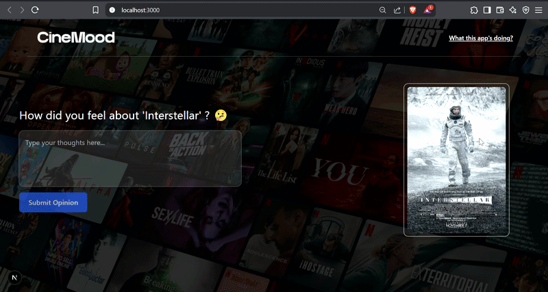

# 🎬 CineMood - Movie Sentiment Analysis Web App

CineMood is an interactive web application that demonstrates real-time sentiment analysis on movie reviews. Users can input their opinion about various movies, and our AI model, built with Python and Natural Language Processing techniques, will predict whether the sentiment is Positive, Negative, or Neutral. The results are displayed in a user-friendly and visually engaging interface.

This project was a collaborative effort by **NOUARI Oualid**, **HAMOUCHE Oussama** and **EL GHAZALI Amine**.

---

## ✨ Features

* **Random Movie Prompts:** Displays a random movie poster and a question to inspire user reviews.
* **Real-time Sentiment Prediction:** Analyzes user-submitted text and returns sentiment (Positive, Negative, Neutral).
* **Interactive Results Modal:**  
    * Clear display of the predicted sentiment with engaging SVG icons.
    * Non-technical explanations of the sentiment.
    * Visual representation of the AI's confidence score.
    * Breakdown of positive and negative probabilities.
    * Smooth animations for a better user experience.
* **"About This App" Modal:** Provides insights into the project's purpose, the technology stack, and a simplified explanation of how the sentiment analysis works.
* **Responsive Design:** User-friendly interface adaptable to different screen sizes.

## 🛠️ Technology Stack

* **Frontend:**
    * Next.js 15
    * TypeScript
    * Tailwind CSS
* **Backend (API):**
    * Python 3.10
    * Flask
* **AI / Machine Learning / NLP:**
    * NLTK (Natural Language Toolkit): For text preprocessing (cleaning, tokenization, lemmatization).
    * Gensim: For GloVe word embeddings.
    * Scikit-learn: For the Support Vector Machine (SVM) classification model.
    * Joblib: For saving and loading the trained model.
* **Dataset (for training):**
    * IMDB Dataset of movie reviews was used to train the sentiment analysis model.

## 📂 Project Structure

The project is organized into two main folders within the root `sentiment-analysis-project/` directory:

* `frontend/`: Contains the Next.js frontend application.
* `model/`: Contains the Python backend, including the Flask API, the trained model (`glove_embedding_svm_model.pkl`), and the original Jupyter Notebook (`Final_project.ipynb`) detailing the model development.

## 🚀 Setup and Installation

### Prerequisites

* Node.js (v18 or later recommended for Next.js 14+)
* npm (comes with Node.js) or yarn
* Python (v3.8 - v3.10 recommended)
* pip (Python package installer, comes with Python)

### 1. Backend Setup (Python Flask API)

**Clone the repository and navigate to the backend directory :**
git clone https://github.com/Oualid-Nouari/CineMood-sentiment-analysis.git  
`cd CineMood-sentiment-analysis/model/` # Or your backend folder name

**Create and activate a Python virtual environment :**

→ For macOS/Linux :  
`python3 -m venv sentiment-env`  
`source sentiment-env/bin/activate`

→ For Windows :  
`python -m venv sentiment-env`  
`.\sentiment-env\Scripts\activate`

Install the required Python packages:  
`pip install -r requirements.txt`

### 2. Frontend Setup (Next.js App)

Navigate to the frontend directory from the project root:  
`cd ../frontend/` 

Install the Node.js dependencies:  
`npm install`

or if you use yarn :  
`yarn install`

## 🏃 Running the Application
You need to run both the backend API and the frontend application separately, in two different terminal windows.

### 1. Start the Backend (Flask API):
- Open a terminal.
- Navigate to your backend directory.
- Run the Flask app: `python app.py`  
(The API should now be running on http://localhost:5001).

### 2. Start the Frontend (Next.js App):
- Open another terminal.
- Navigate to your frontend directory.
- Run the Next.js development server:  
 `npm run dev` OR `yarn dev`
(The frontend should now be accessible in your browser at http://localhost:3000).

## 🎮 How to Use
- Open your web browser and navigate to http://localhost:3000.
- The application will display a movie poster and a question related to it.
- Type your opinion or review for the displayed movie in the provided text area.
- Click the "Submit Opinion" (or similar) button.
- A modal window will appear, showing the predicted sentiment (Positive, Negative, or Neutral) of your review.
- The modal also provides additional details like the AI's confidence score and the underlying probabilities for positive and negative sentiments.
- Close the results modal to receive a new random movie prompt.
- Click on the "What this app's doing?" link in the header to open a modal explaining the project's purpose, technologies, and how the sentiment analysis works.

## 💡 "Behind the Project" - How It Works Briefly :
CineMood uses a pre-trained Support Vector Machine (SVM) model to classify sentiment. When a review is submitted:  

1. **Text Preprocessing :** The input is cleaned (HTML removal, lowercasing), tokenized, and lemmatized. Special care is taken to handle negations and potential sarcasm cues to improve understanding.
2. **Word Embeddings (GloVe) :** Cleaned words are transformed into numerical vectors using GloVe, capturing their semantic meaning.
3. **Sentiment Prediction :** This vector representation is fed to the SVM model, which outputs probabilities for positive and negative classes.
4. **Classification :** Based on these probabilities and a confidence threshold (if abs(P_positive - P_negative) < 0.4 in our setup, it's deemed Neutral), the final sentiment is determined.
5. Details about the project, technology, and methodology are also available in the "What this app's doing?" modal within the application.

## 🤝 Contributors
This project was proudly developed by:
### NOUARI OUALID :
- Github : https://github.com/Oualid-Nouari
- LinkedIn : https://www.linkedin.com/in/oualidnouari/

### HAMOUCHE OUSSAMA : 
- Github : https://github.com/HamoucheOussama11
- LinkedIn : https://www.linkedin.com/in/oussama-hamouche-a27580234/

### EL GHAZALI AMINE : 
- Github : https://github.com/amineelghazali
- LinkedIn : https://www.linkedin.com/in/amine-el-ghazali-512684328/

